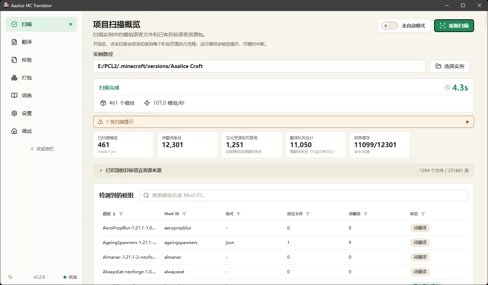
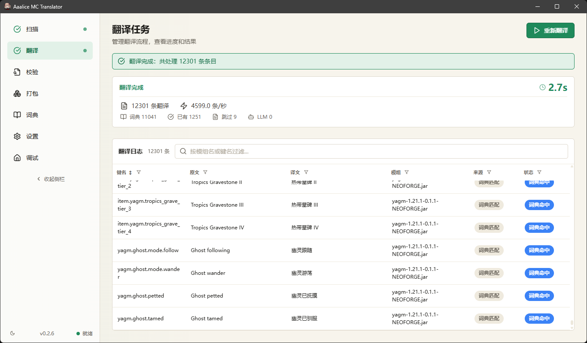
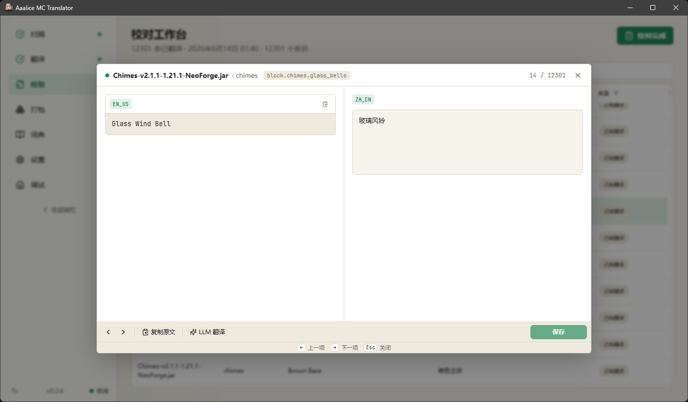
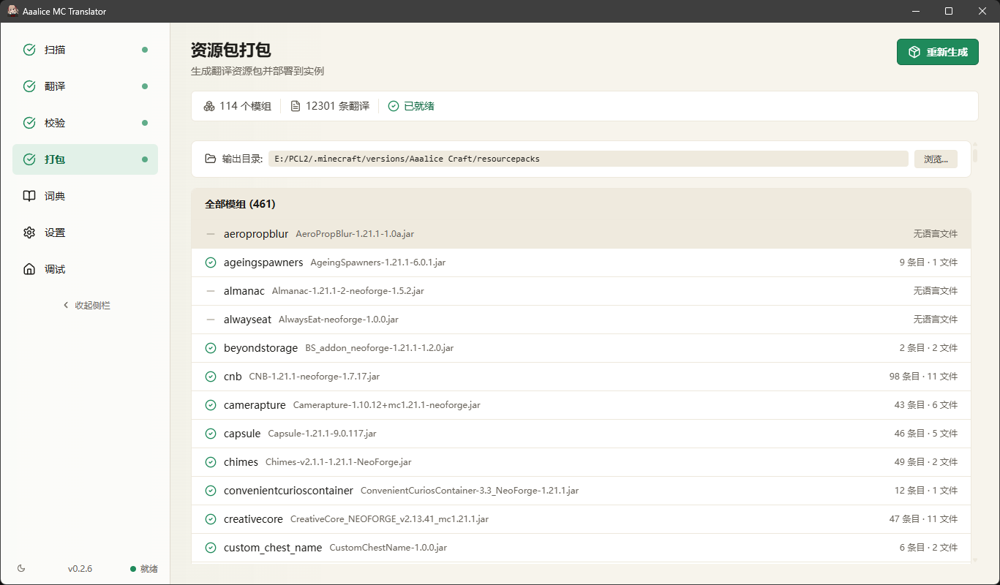
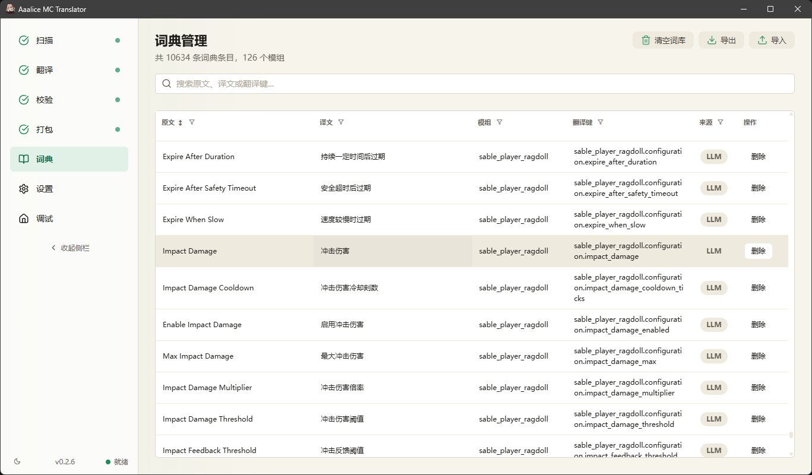
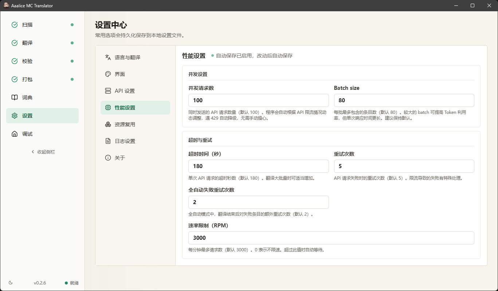
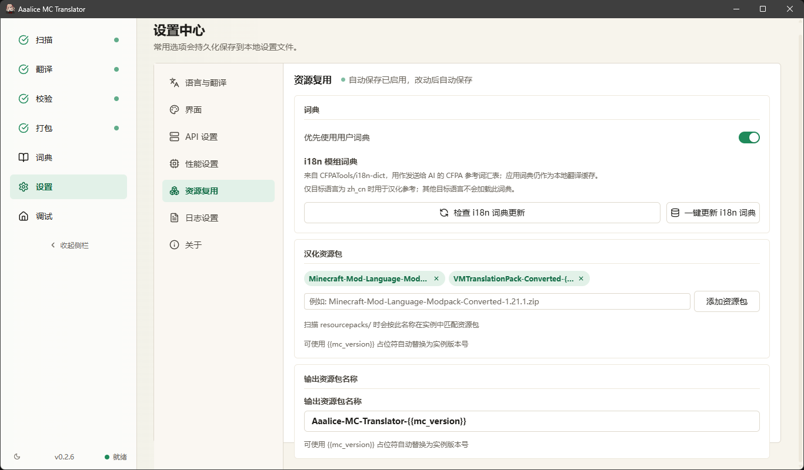

# Aaalice MC Translator

> Windows 桌面端 Minecraft 整合包汉化工具。扫描模组语言文件，复用已有翻译，并通过 LLM 补齐缺口，最终输出可直接加载的资源包。

<p align="center">
  
</p>

<p align="center">
  <b>简体中文</b> · <a href="README.en-US.md">English</a>
</p>

---

## 项目定位

Aaalice MC Translator 面向大型 Minecraft 整合包的本地化流程：扫描实例中的 mod 语言资源，复用已有资源包、本地词典和 i18n 参考词典，再把剩余缺口交给 LLM 翻译。生成结果会打包为标准资源包，不直接修改原始 mod JAR。

适合这些场景：

- 整合包包含大量 mod，手工定位语言文件和缺失条目成本太高。
- 已经有一部分汉化资源，希望优先复用并只补齐缺口。
- 需要持续维护翻译缓存、人工校对结果，并在多次扫描/翻译之间复用已有成果。
- 需要控制 LLM 并发、批大小、RPM、超时和重试，避免一次性翻译大包时失控。

## 核心能力

- **实例扫描与条目统计**：并行遍历实例目录和 mod JAR，提取 `.json` / `.lang` 语言文件，并汇总可汉化条目、已有资源包命中和待翻译缺口。
- **翻译并发池配置**：维护由并发请求数、`Batch size`、超时、重试次数和 RPM 限速组成的 LLM 请求池，兼容 DeepSeek、OpenAI 以及 OpenAI-compatible API。
- **本地翻译缓存**：优先复用历史翻译结果，减少重复请求；翻译完成后的结果也会写入本地词典，供后续扫描和翻译继续命中。
- **词典维护**：词典页提供搜索、编辑、删除、导入、导出和清空能力，用于维护 mod 术语、人工校对结果和历史缓存。
- **模型与提示词配置**：支持配置模型、请求参数和角色提示词，用于约束物品名、方块名、任务文本等 Minecraft 场景下的翻译风格。
- **i18n 参考词库**：接入 CFPATools/i18n-dict 作为 `zh_cn` 参考来源，用于对齐常见 mod 术语，降低不同模组之间的翻译差异。
- **占位符与格式保护**：翻译前后保留 Minecraft 格式码、变量、`String.format` 占位符、`{player}`、`{{...}}`、`<item:...>` 等特殊片段，避免影响游戏内显示或运行逻辑。
- **翻译结果校验**：检查缺失译文、占位符缺失和格式异常；校验失败的条目会进入失败队列，便于重试或人工处理。
- **校对与单条重译**：校对工作台支持逐条查看原文和译文、手动保存修改，并可对单个条目重新调用 LLM。
- **任务取消与恢复**：扫描和翻译任务支持取消；翻译任务会保存进度和结果文件，后续可继续读取已有结果，减少重复执行。
- **资源包生成与更新**：生成标准资源包 zip，并按 Minecraft 版本写入 `pack.mcmeta`；输出文件名固定或可配置，复制到实例时会按同名资源包更新现有输出。
- **日志与错误诊断**：保留主日志、任务日志和错误信息，支持在界面中查看排查线索；调试日志会按设置启用。
- **自动流程**：全自动模式可串联扫描、翻译、校验和打包；长流程期间保留进度、日志和失败项重试入口。
- **主题与界面偏好**：支持浅色/暗色主题切换，并将主题偏好保存到本地设置。

## 界面截图

<table>
  <tr>
    <td width="50%">
      
      <br />
      <sub>扫描概览：展示模组、资源文件、待翻译条目和词典缓存命中。</sub>
    </td>
    <td width="50%">
      
      <br />
      <sub>翻译任务：展示翻译吞吐、词典命中、已有翻译、跳过条目和 LLM 调用结果。</sub>
    </td>
  </tr>
  <tr>
    <td width="50%">
      
      <br />
      <sub>校对工作台：逐条查看原文和译文，支持复制原文、调用 LLM 重译和人工保存。</sub>
    </td>
    <td width="50%">
      
      <br />
      <sub>资源包打包：按 mod 汇总可输出条目，生成可直接放入 <code>resourcepacks/</code> 的资源包。</sub>
    </td>
  </tr>
  <tr>
    <td width="50%">
      
      <br />
      <sub>词典管理：搜索、编辑、删除、导入和导出翻译缓存，维护整合包长期术语资产。</sub>
    </td>
    <td width="50%">
      
      <br />
      <sub>性能设置：维护翻译并发池、批大小、超时、重试和速率限制。</sub>
    </td>
  </tr>
  <tr>
    <td colspan="2">
      
      <br />
      <sub>资源复用：管理 i18n 参考词典、已有汉化资源包和输出资源包命名规则。</sub>
    </td>
  </tr>
</table>

## 快速开始

### 系统要求

- Windows 10 / Windows 11 64 位
- 一个标准 Minecraft 实例目录，例如 PCL2、HMCL 或官方启动器实例
- 可用的 LLM API Key

### 安装

从 [Releases](https://github.com/Aaalice233/Aaalice_Minecraft_Translator/releases) 下载最新版。

- 安装版：推荐普通用户下载，支持自定义安装目录、开始菜单/快捷方式和应用内自动更新。
- 便携版：无需安装，适合临时使用或放在 U 盘中随身携带；更新时需要手动下载新版。

应用支持自动更新，可在「设置 -> 关于与更新」里检查新版本。

### 基本流程

```text
选择 MC 实例 -> 扫描模组 -> 配置 LLM API -> 开始翻译 -> 校对结果 -> 打包资源包
```

生成的资源包可以复制到实例的 `resourcepacks/` 目录中使用。

如果启用全自动模式，应用会按当前设置自动串联扫描、翻译、校验和打包；任一阶段失败时会保留真实错误、日志和当前进度，便于继续排查。

## 开发

### 环境要求

- Node.js 20+
- npm 10+
- Rust stable

### 常用命令

| 操作 | 命令 |
| --- | --- |
| 启动前端开发服务器 | `npm run dev` |
| 启动 Tauri 开发模式 | `npm run tauri dev` |
| 前端构建 | `npm run build` |
| 前端测试 | `npm run test:unit` |
| Rust 测试 | `npm run test:rust` |
| 生成 NSIS 安装器 | `npm run package:exe` |
| 生成便携版 exe | `npm run package:app` |

## 项目结构

```text
Aaalice_Minecraft_Translator/
├── assets/                  应用图标与资源包图标
├── data/                    运行期本地数据，已被 .gitignore 忽略
├── docs/                    产品、架构、UI 与测试文档
├── logs/                    运行期日志，已被 .gitignore 忽略
├── scripts/                 打包与辅助脚本
├── src/                     React + TypeScript 前端
│   ├── api/                 Tauri API 封装与浏览器 mock
│   ├── app/                 App 壳、Context 与全局状态同步
│   ├── components/          通用 UI 组件
│   ├── hooks/               通用 React hooks
│   ├── i18n/                界面多语言字典
│   ├── pages/               功能页面
│   ├── stores/              Zustand 状态
│   └── styles/              全局样式
├── src-tauri/               Tauri 2 + Rust 后端
│   ├── src/commands/        Tauri commands
│   ├── src/core/            扫描、词典、LLM、打包、日志等核心逻辑
│   └── tauri.conf.json      窗口、打包和更新器配置
├── tests/                   Vitest 测试与 fixture
├── CHANGELOG.md             版本变更日志
├── LICENSE                  MIT 许可证
├── README.en-US.md          英文 README
└── README.md                中文 README
```

## 技术栈

### 前端

- React 18
- TypeScript 5
- Vite 6
- Zustand
- react-virtuoso
- lucide-react
- Vitest + Testing Library

### 后端

- Tauri 2
- Rust 2021
- Rayon
- reqwest
- rusqlite
- serde / serde_json
- zip
- tracing

## 核心约定

- 不直接修改原始 mod JAR。
- 不未经确认替换用户已有资源包。
- 资源包输出使用 `assets/<modid>/lang/<targetLanguage>.json`。
- 前后端类型通过 camelCase JSON 同步，修改数据结构时需要同时更新 `src/types.ts` 和 `src-tauri/src/core/models.rs`。
- 新增界面文案需要写入 `src/i18n/translations.ts`。

## 文档

完整文档索引见 [docs/00-index.md](docs/00-index.md)。

## 参考项目

- [MineAI-Modpack-Translator](https://github.com/Thedrezik/MineAI-Modpack-Translator)
- [mc-autotranslator](https://gitee.com/li27744/mc-autotranslator)

## 致谢

- 内置 i18n 模组词典来自 [CFPATools/i18n-dict](https://github.com/CFPATools/i18n-dict)，原始发布页见 [i18n-dict releases](https://github.com/CFPATools/i18n-dict/releases)。

## 许可证

本项目使用 [MIT License](LICENSE)。
