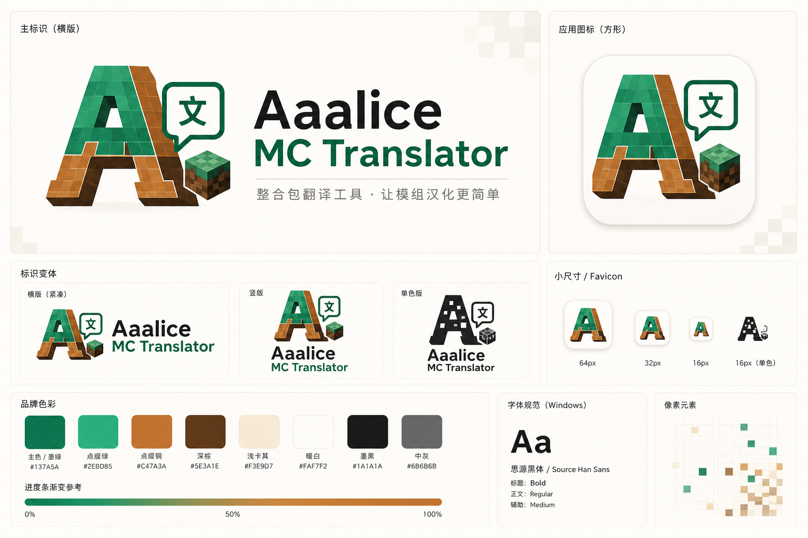
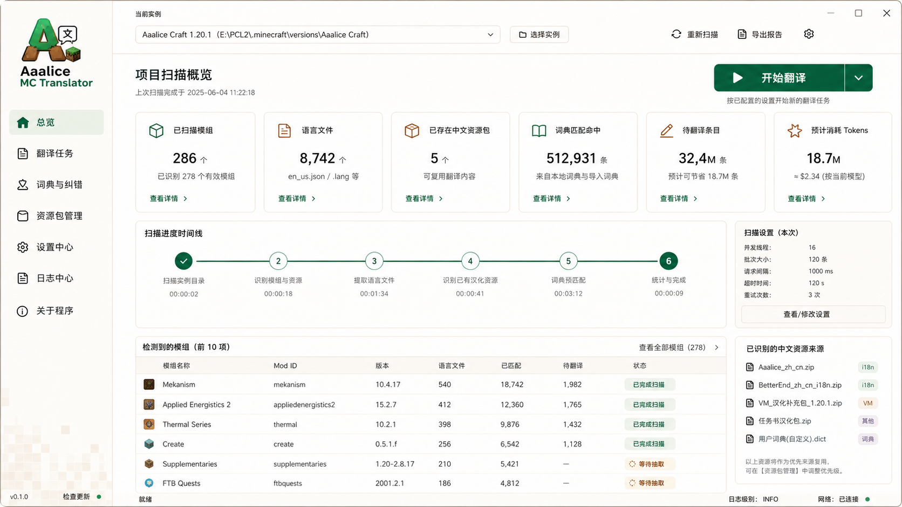
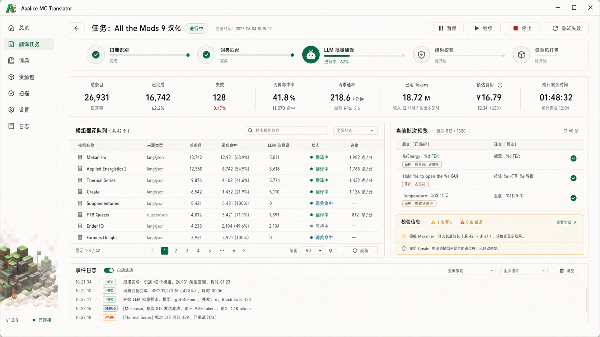
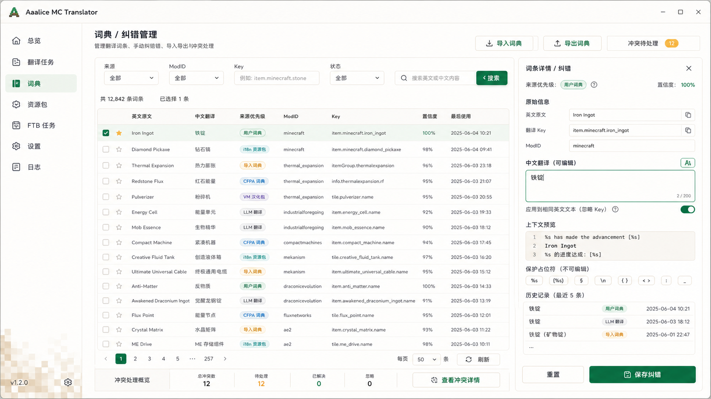
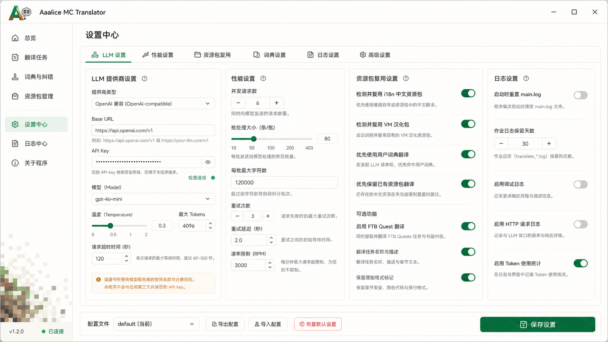
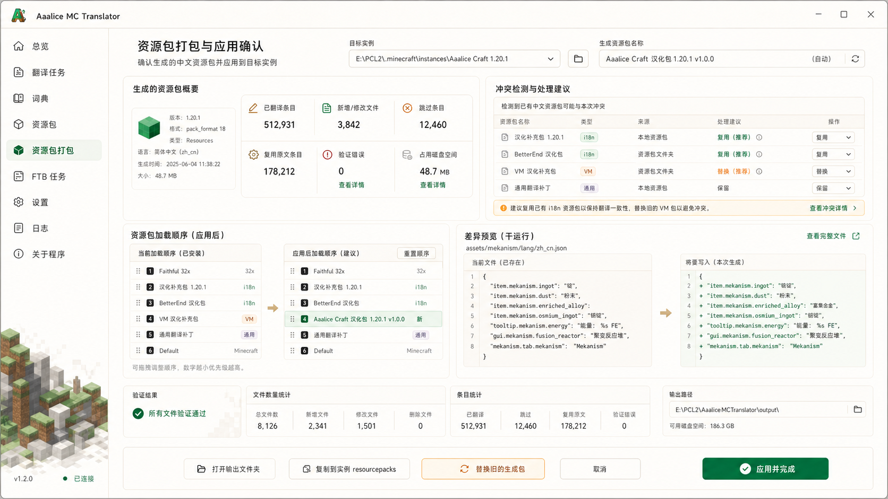
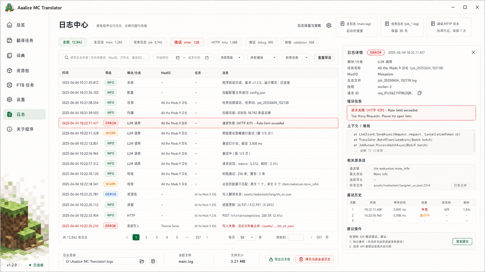
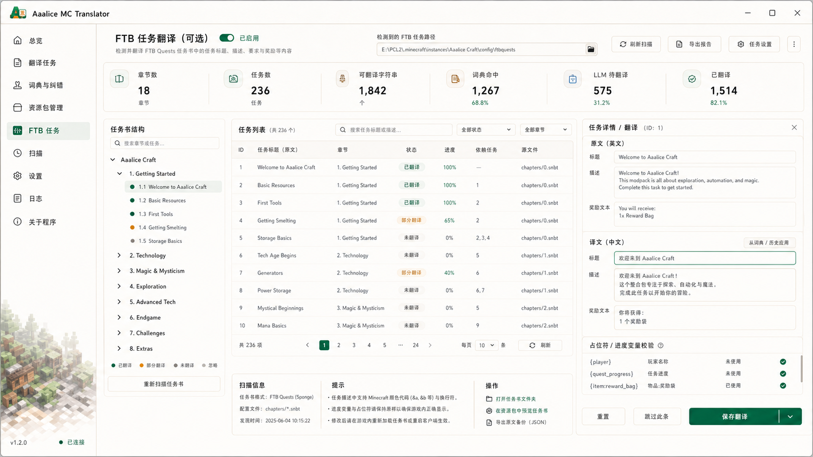
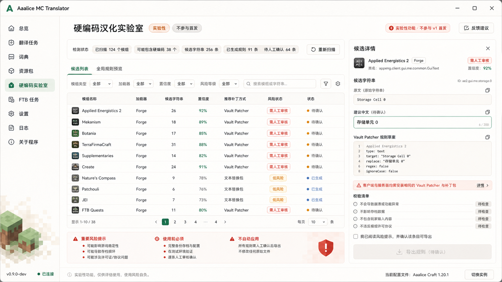

# UI 参考图

本目录保存逐页生成的 UI 参考图。图片只是视觉和信息架构参考，后续实现时以功能规格和实际组件约束为准。

## 图片清单

### 01 品牌与 Logo

用途：

- app icon。
- 侧边栏 wordmark。
- 资源包图标基础方向。

### 02 总览页

用途：

- 实例选择。
- 扫描摘要。
- 资源包复用概览。
- 开始翻译入口。

### 03 翻译进度页

用途：

- 任务阶段。
- per-mod 队列。
- 费用和 token。
- 当前 batch 预览。
- 校验警告。

### 04 词典浏览与纠错页

用途：

- 词典搜索。
- 来源优先级。
- 手动纠错。
- 导入导出。

### 05 设置页

用途：

- LLM URL、Key、model。
- 并发和 batch size。
- 资源包复用。
- FTB 开关。
- 日志策略。

### 06 资源包打包确认页

用途：

- 输出资源包摘要。
- 冲突确认。
- dry-run diff。
- 复制或替换确认。

### 07 日志诊断页

用途：

- 日志过滤。
- 错误详情。
- retry history。
- 日志导出。

### 08 FTB 任务汉化页

用途：

- FTB Quest tree。
- 任务文本翻译。
- 手动纠错。

### 09 硬编码实验室

用途：

- Vault Patcher 草案。
- 风险确认。
- 二期实验功能入口。

首期不自动应用硬编码补丁。
